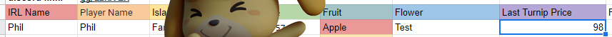

# ACNHTurnipBot
Automatically post Google Sheets onEdit turnip prices to Discord

Functionality list: Only grab cells within specified range, only on the named sheet. Grab the username and real name of the player. Post as soon as they edit their price. Discord has a timestamp for the message, and now we can see when people's prices were posted (am/pm).

Source data: Simple google sheet.

Discord Webhook in action, and example of realname/username functionality

